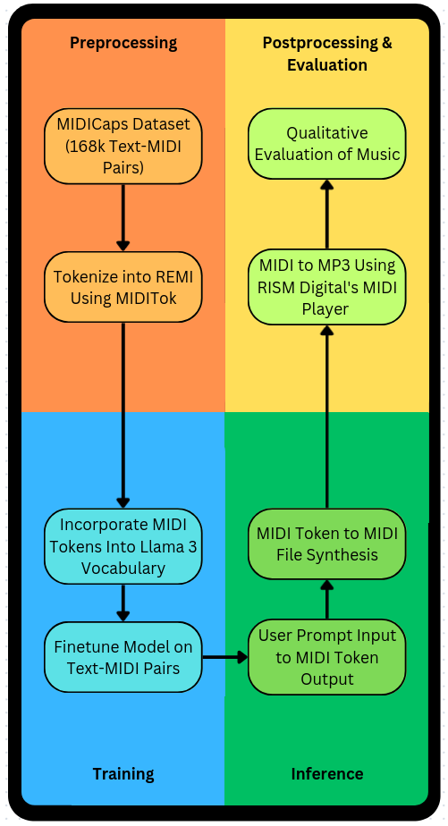

# Lexical Lullabies

**Decoder-only LLM-based text-to-MIDI generation with music theory constraints**  
Created as a final project for CAP6640 at the University of Central Florida

---

## 🧠 Overview



Lexical Lullabies explores the intersection of natural language and symbolic music generation using decoder-only large language models. Built on top of LLaMA 3.2 and trained on the MIDICaps dataset, this project demonstrates a novel, modular approach to translating textual descriptions into structured MIDI sequences.

By enforcing music theory constraints via MIDI tokenization (REMI format), this model learns to structure outputs around quantized musical representations like pitch, duration, and velocity — bridging the gap between language prompts and symbolic music generation.

---

## 🎯 Objectives

- Fine-tune a decoder-only LLM (LLaMA 3.2) on a text-to-MIDI task using the MIDICaps dataset  
- Extend the tokenizer with REMI-based symbolic music vocabulary  
- Apply curriculum training and loss weighting to prioritize MIDI grammar acquisition  
- Generate valid and structured MIDI sequences from natural language descriptions  
- Evaluate generation quality using BLEU-4, ROUGE-L, and token-level grammar checks

---

## 📊 Key Results

| Metric                      | Score   |
|-----------------------------|---------|
| BLEU-4                      | 10.70   |
| ROUGE-L                     | 22.86   |
| MIDI Structure Validity (3-shot) | ~12%    |

> The model successfully produced thousands of MIDI sequences from natural language prompts, with nearly 12% of outputs passing strict structural validation checks. These results demonstrate the model’s capacity to learn and apply symbolic music grammar — a strong foundation for future work.

---

## 🧩 Architecture

- **Base Model**: `meta-llama/Llama-3.2-1B`
- **Tokenization**: REMI + `<MIDI_START>`, `<MIDI_END>` delimiters
- **Training Strategy**: Two-phase curriculum training (pure MIDI → paired captions)
- **Loss Function**: Weighted cross-entropy emphasizing MIDI tokens
- **Evaluation**: BLEU, ROUGE, and MIDI grammar rule validation

---

## 🏗️ Project Structure

```

lexical-lullabies/
├── notebooks/                # Colab notebooks and experiments
├── src/                      # Python scripts and training code
├── media/                    # Diagrams, sample outputs, report
├── requirements.txt
└── README.md

````

---

## 🛠️ Installation

This project was developed and tested using Google Colab on a single NVIDIA L4 GPU. If running locally:

```bash
pip install -r requirements.txt
````

---

## 🚀 Run Training

1. Upload the MIDICaps dataset to Google Drive
2. Use the provided notebook or script to extract, clean, tokenize, and train the model
3. The system uses 3-shot priming and MIDI-aware loss for more structured generations
4. Outputs are automatically decoded from REMI tokens to MIDI and can be converted to audio via FluidSynth

---

## 💡 Example Prompt

```text
"A mellow jazz solo with blues influences in D minor."

→ <MIDI_START> Program_0 Pitch_62 Duration_8 Velocity_60 ...
```

Tokenized MIDI outputs are converted back into `.midi` format using MIDITok. The pipeline supports zero-shot and few-shot inference modes with configurable sampling parameters.

---

## 🧪 Limitations & Future Work

* Some outputs were musically trivial or overly simple, as expected in early-stage sequence generation
* Decoder-only architecture struggles with long-range structure
* MIDI grammar violations remain a challenge in zero-shot settings

Future directions include:

* Grammar-enforcing loss functions
* Music-theoretic evaluation metrics (e.g. tempo/key stability)
* Data curation filters for improved training quality
* Exploring encoder-decoder or larger models for better coherence

---

## ✅ Summary

Lexical Lullabies is a strong proof of concept: a working text-to-MIDI pipeline using a decoder-only LLM with music theory constraints. It demonstrates that symbolic music generation is achievable from natural language with structure-aware fine-tuning, even on constrained hardware.

This project lays a technical foundation for future systems that aim to turn plain language into playable, structured, and emotionally resonant music — unlocking new creative possibilities at the intersection of LLMs and digital audio.

---

## 📁 Resources

* 📄 Final Report (PDF): in `/media`
* 💻 Training Code: in `/src`
* 📓 Colab Notebook: in `/notebooks`

---

## 📬 Contact

**Christian King**  
Email: [christiankingcompsci@gmail.com](mailto:christiankingcompsci@gmail.com)  
Portfolio: [christianking.dev](https://christianking.dev)

